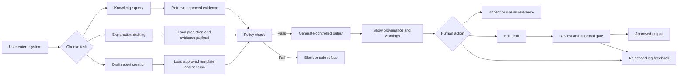
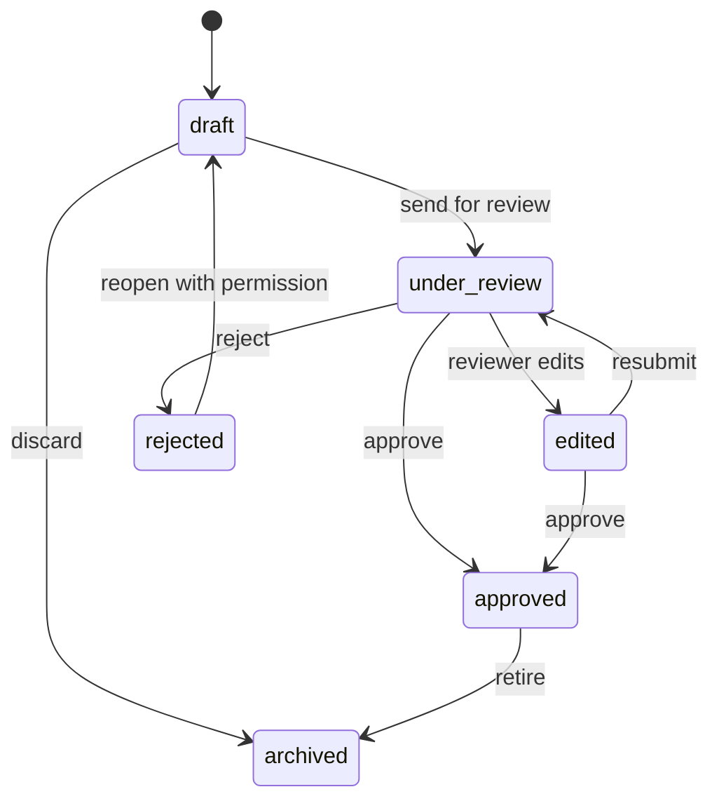
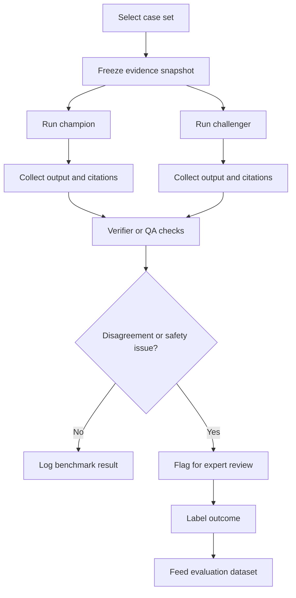

# PRD chi tiet cho UI, workflow va yeu cau van hanh he thong RAG y te

## 1. Thong tin tai lieu

| Truong | Noi dung |
| --- | --- |
| Ten tai lieu | PRD chi tiet cho UI va workflow he thong RAG y te co kiem soat |
| Pham vi | He thong RAG ho tro tri thuc noi bo, explanation drafting, report drafting va review workflow |
| Doi tuong doc | Product owner, BA, UX/UI, ky thuat, nhom AI, nhom QA, nhom an toan thong tin, nhom nghiep vu y te |
| Tai lieu lien quan | `docs/yeu_cau_he_thong_rag.md`, `note/de_cuong_nghien_cuu.md`, `docs/wireflow_screen_by_screen_ui_rag.md`, `docs/pcxr_post_processing_spec.md`, `docs/pcxr_detector_pipeline.schema.json` |
| Trang thai de xuat | Draft phuc vu thiet ke va lap ke hoach trien khai |

## 2. Muc dich tai lieu

Tai lieu nay mo ta chi tiet san pham o muc do co the dua vao de thiet ke giao dien, phan ra backlog, thiet ke API, xay dung test case va to chuc nghiem thu noi bo. Trong boi canh y te, PRD nay uu tien bon muc tieu:

- giup nguoi dung tim, doc va kiem tra bang chung nhanh hon;
- bao dam moi dau ra AI deu bi gioi han boi intended use, provenance va guardrail;
- toi uu workflow human-in-the-loop cho bac sy, nhom nghien cuu va nhom quan tri;
- tao audit trail day du cho su dung lam sang, nghien cuu va dieu tra su co.

## 3. Tuyen bo san pham

He thong khong phai chatbot tu do va khong duoc dinh vi la cong cu chan doan doc lap. He thong la mot lop tro giup tri thuc co kiem soat, phuc vu cac tac vu sau:

- tra cuu guideline, SOP, protocol, tai lieu noi bo da duoc phe duyet;
- sinh giai thich ngon ngu tu nhien dua tren evidence da xac thuc;
- sinh nhap bao cao, nhap hoi chan, bieu mau nghien cuu de con nguoi ra soat;
- so sanh model trong moi truong nghien cuu co kiem soat;
- thu nhan phan hoi va log de cai tien he thong.

San pham khong phuc vu cac muc tieu sau:

- tu dong dua ra chan doan cuoi cung ma khong co con nguoi duyet;
- tu dong de xuat y lenh, ke don hoac phac do dieu tri bat buoc;
- cho phep truy hoi tu nguon tai lieu chua duoc cap phep;
- hien thi internal reasoning thap cho nguoi dung cuoi de thuyet phuc qua muc can thiet.

## 4. Nguyen tac thiet ke theo chuan y te

### 4.1. Nguyen tac cot loi

| Ma | Nguyen tac | Dien giai |
| --- | --- | --- |
| MED-01 | Intended use first | Moi man hinh, thao tac va thong diep can the hien ro muc dich su dung va gioi han su dung. |
| MED-02 | Human review by default | Moi noi dung nhay cam ve lam sang, hoi chan hoac bao cao deu duoc thiet ke quanh buoc ra soat va duyet cua con nguoi. |
| MED-03 | Provenance visible | Nguoi dung phai thay duoc noi dung den tu dau, phien ban tai lieu nao, model nao va sinh luc nao. |
| MED-04 | Fail closed | Khi thieu bang chung, loi schema, loi tai lieu, loi quyen han hoac loi he thong, UI phai ngan phat hanh dau ra thay vi hien thi nhu hop le. |
| MED-05 | Least surprise | Giao dien tranh tao cam giac AI "biet chac" hon muc evidence cho phep. |
| MED-06 | Separation of raw AI and approved content | Noi dung AI sinh va noi dung da duyet phai tach bach bang nhan, mau sac, khu vuc va trang thai. |
| MED-07 | Role-based visibility | Nguoi dung chi thay thong tin, thao tac va cong cu phu hop vai tro. |
| MED-08 | Auditability | Moi thao tac co y nghia nghiep vu phai truy vet duoc ai, luc nao, tren episode nao, voi policy nao. |

### 4.2. Dien giai theo tinh than TRIPOD+AI va governance y te

PRD nay ap dung cac nguyen tac quan trong cua tai lieu bao cao y te va AI trong y khoa theo huong thuc thi UI va workflow:

- mo ta ro nguoi dung dich, quan the dich va care pathway;
- hien thi gioi han ap dung va canh bao cho ca vuot pham vi;
- the hien uncertainty va tinh day du cua bang chung;
- dam bao kha nang danh gia, truy vet, minh bach va doi chieu sau su co;
- khong de UI day nguoi dung den tac phong phu thuoc qua muc vao AI;
- uu tien kha nang kiem dinh noi bo, nghien cuu pilot va review da chuyen mon.

## 5. Muc tieu san pham va chi so thanh cong

### 5.1. Muc tieu kinh doanh va nghiep vu

- rut ngan thoi gian tim guideline va SOP cho bac sy hoac nhom nghien cuu;
- giam thoi gian soan nhap bao cao hoac hoi chan co cau truc;
- tang kha nang truy vet nguon goc noi dung khi co tranh chap hoac review noi bo;
- tao nen tang an toan de thuc hien pilot, reader study va danh gia champion-challenger.

### 5.2. Muc tieu UX

- nguoi dung nhin thay canh bao, provenance va trang thai review trong vong 3 giay dau;
- nguoi dung mo duoc doan tai lieu goc lien quan trong toi da 2 thao tac;
- nguoi duyet co the xac dinh field nao do AI sinh, field nao do nguoi sua ma khong can roi man hinh;
- nguoi dung co the bac bo hoac bao loi citation bang mot thao tac ro rang.

### 5.3. KPI de xuat cho UI va workflow

| Nhom KPI | Dinh nghia | Muc tieu pilot de xuat |
| --- | --- | --- |
| Time to first evidence | Thoi gian tu luc mo ket qua den luc mo duoc bang chung goc | <= 10 giay |
| Report review time | Thoi gian trung vi de ra soat va chinh sua 1 draft report chuan | giam 20-30% so voi quy trinh thu cong |
| Safe reject discoverability | Ti le nguoi dung xac dinh duoc ly do he thong tu choi hoac can review | >= 90% |
| Provenance coverage visibility | Ti le field co the xem provenance truc tiep tren UI | 100% voi field trong yeu |
| User correction traceability | Ti le lan chinh sua duoc luu day du trong audit trail | 100% |

## 6. Nguoi dung, vai tro va quyen han

### 6.1. Nhom nguoi dung chinh

| Vai tro | Mo ta | Nhu cau chinh | Rui ro neu thiet ke sai |
| --- | --- | --- | --- |
| Bac sy lam sang | Su dung de tra cuu guideline, xem giai thich, duyet hoac sua nhap bao cao | Can UI nhanh, ro bang chung, ro canh bao | Co the tin qua muc vao AI neu provenance bi an |
| Bac sy chan doan hinh anh | Xem thong tin episode, nhap report, doi chieu evidence va phe duyet | Can review screen co cau truc va diff ro | Co the bo sot loi neu field AI va field human khong tach bach |
| Nghien cuu vien | Tao bieu mau nghien cuu, xem ca shadow, so sanh model, tong hop feedback | Can analytics, compare mode, xuat du lieu | Co the rut ra ket luan sai neu compare mode khong cong bang |
| Quan tri tri thuc | Quan ly tai lieu, version, metadata, hieu luc | Can dashboard tai lieu, diff version, quy trinh phat hanh | Co the de tai lieu loi thoi vao kho phuc vu |
| Quan tri he thong | Quan ly RBAC, cau hinh policy, theo doi log va rollback | Can nhin thay su co, drift, loi schema, latency | Co the mo nham quyen hoac bo sot su co neu UI nghiem trong qua phan tan |
| QA va an toan AI | Kiem tra groundedness, loi trich dan, bao cao su co | Can truy vet log, replay, compare champion-challenger | Co the khong tim duoc nguyen nhan neu log khong lien thong |

### 6.2. Ma tran quyen han toi thieu

| Chuc nang | Bac sy lam sang | CĐHA | Nghien cuu | Quan tri tri thuc | Quan tri he thong | QA |
| --- | --- | --- | --- | --- | --- | --- |
| Xem cau tra loi RAG | Co | Co | Co | Co | Co | Co |
| Mo tai lieu goc | Co | Co | Co | Co | Co | Co |
| Tao draft report | Co han che theo vai tro | Co | Co neu duoc cap | Khong | Khong | Khong |
| Sua draft report | Co han che | Co | Co neu workflow nghien cuu | Khong | Khong | Khong |
| Phe duyet draft report | Theo phan quyen | Co | Theo protocol nghien cuu | Khong | Khong | Khong |
| Xem compare champion-challenger | Khong mac dinh | Khong mac dinh | Co | Khong | Co | Co |
| Quan ly template form | Khong | Khong | Co han che | Co | Co | Khong |
| Quan ly tai lieu tri thuc | Khong | Khong | Co han che | Co | Co | Khong |
| Xem log he thong day du | Khong | Khong | Co han che | Co han che | Co | Co |

## 7. Gia dinh van hanh va pham vi ky thuat

- he thong uu tien desktop va laptop trong moi truong benh vien;
- man hinh toi uu cho do rong 1366 px tro len;
- mobile khong phai luong chinh cho thao tac duyet, sua hoac phe duyet;
- he thong co the tich hop voi HIS, EMR, PACS, kho guideline noi bo va dich vu auth benh vien;
- retrieval, generation, verification, logging va policy engine la cac thanh phan tach roi;
- model co the chay local on-premise; UI phai the hien ro khi thanh phan nao khong san sang.

## 8. Kien truc thong tin va dieu huong

### 8.1. So do dieu huong cap cao

Dieu huong cap cao de xuat gom 6 khu vuc:

- Worklist va Dashboard;
- Tra cuu tri thuc;
- Episode Workspace;
- Review Draft Report;
- Quan ly tai lieu va template;
- Van hanh, Audit va Compare.

### 8.2. Cau truc menu trai de xuat

| Muc menu | Doi tuong thay | Chuc nang chinh |
| --- | --- | --- |
| Trang chu | Tat ca | Worklist, canh bao, shortcut, feed su co |
| Tra cuu tri thuc | Lam sang, nghien cuu, QA | Hoi dap RAG, citations, timeline nguon |
| Episode | Lam sang, CĐHA, nghien cuu | Xem thong tin ca, explanation, draft, feedback |
| Draft reports | CĐHA, nghien cuu, lam sang duoc cap | Danh sach nhap, trang thai, nguoi duyet |
| Compare models | Nghien cuu, QA, admin | Shadow results, disagreement, verifier flags |
| Knowledge base | Quan tri tri thuc, admin | Tai lieu, version, metadata, release status |
| Audit va ops | Admin, QA | Log, incident, rollback, drift, health |

### 8.3. Nguyen tac dieu huong

- breadcrumb luon hien thi vi tri nguoi dung trong care pathway;
- luong lam sang chinh khong di qua man hinh ky thuat neu khong can;
- luong research va compare tach biet khoi luong ra quyet dinh lam sang;
- tu moi answer va draft, nguoi dung phai tro ve duoc episode va bang chung goc;
- moi hanh dong nguy co cao can co modal xac nhan ro ly do.

## 9. Nguyen tac UI va visual design

### 9.1. Dinh huong tong the

Giao dien can uu tien tinh ro rang, nhat quan, trung tinh va de doc trong moi truong benh vien. Muc tieu khong phai an tuong thi giac ma la giam tai nhan thuc va giam sai sot thao tac.

### 9.2. Quy tac visual bat buoc

- dung hierarchy ro rang giua du lieu benh nhan, evidence, AI draft va approved content;
- khong dung mau sac lam kenh duy nhat de phan biet trang thai;
- canh bao an toan dung icon kem nhan van ban ro nghia;
- field do AI sinh phai co nhan, khung hoac style nhan biet duoc;
- thong tin benh nhan nhay cam khong hien lon hon muc can thiet o man hinh cong cong;
- so lieu, don vi do, timestamp, model version va document version dung dinh dang nhat quan.

### 9.3. He thong mau de xuat theo nghia UI

| Nhom mau | Muc dich | Ghi chu |
| --- | --- | --- |
| Neutral | Nen, separator, text chinh | Uu tien contrast cao, met mat thap |
| Info | Citation, provenance, metadata | Khong bi nham voi success |
| Warning | Uncertainty, thieu bang chung, can review | Phai co label van ban kem theo |
| Danger | Loi nghiem trong, vuot pham vi, policy block | Chi dung cho tinh huong can hanh dong |
| Success | Approved, synced, export thanh cong | Khong dung de truyen tai do tin cay y khoa |

### 9.4. Typography va mat do thong tin

- tieu de man hinh 20-24 px; tieu de card 16-18 px; noi dung 14-16 px;
- bang du lieu co mat do vua phai, tranh nhoi qua muc trong man hinh review;
- doan evidence va citations dung font de doc lau, khong qua chat;
- nhan canh bao va provenance co the dung chu hoa nho nhung phai de doc.

## 10. Thanh phan giao dien toan cuc

### 10.1. Global header

Header phai hien thi:

- ten he thong va ten module hien tai;
- context nguoi dung, vai tro, khoa phong neu co;
- bo chon ngon ngu neu ho tro song ngu;
- thong bao he thong va canh bao policy;
- thanh tim nhanh episode, guideline, report hoac tai lieu.

### 10.2. Global patient context bar

Khi dang o episode workspace hoac review report, thanh context benh nhan phai co:

- episode id;
- tuoi, gioi tinh, thoi diem tiep nhan;
- khoa phong hoac workflow stage;
- nhan de xac dinh do nhay cam;
- tinh trang du lieu: du, thieu, khong dong bo, cho xac nhan.

### 10.3. Global action rail

Nut hanh dong chinh co the gom:

- tao draft;
- gui review;
- phe duyet;
- tu choi;
- bao loi citation;
- xem audit trail;
- mo compare mode neu du quyen.

Nguyen tac: nut nguy co cao dat xa nut thong thuong, can xac nhan 2 buoc neu tao anh huong den ho so chuyen mon.

### 10.4. Status chips

He thong can co status chip nhat quan cho:

- draft;
- under review;
- approved;
- rejected;
- archived;
- needs evidence;
- policy blocked;
- low confidence;
- outdated source.

## 11. Mo hinh du lieu nghiep vu tren UI

### 11.1. Doi tuong nghiep vu chinh

| Doi tuong | Mo ta hien thi tren UI |
| --- | --- |
| Episode | Don vi cong viec trung tam gan voi benh nhi, anh, metadata va su kien workflow |
| Query session | Mot phien hoi dap hoac tra cuu guideline co log va citations rieng |
| Answer card | Cau tra loi co noi dung, evidence, warning, model metadata |
| Draft report | Nhap bao cao co template, field, provenance, status, history |
| Evidence item | Doan tai lieu, trich dan, version, owner, muc uu tien |
| Model run | Ban ghi cho mot lan model sinh output, kem latency va policy result |
| Feedback item | Chap nhan, sua, bac bo, bao loi citation, comment |
| Document record | Tai lieu tri thuc, phien ban, metadata, hieu luc, owner |

### 11.2. Trang thai nghiep vu chinh

| Doi tuong | Trang thai |
| --- | --- |
| Query session | idle, searching, answered, refused, needs review, failed |
| Draft report | draft, under_review, edited, approved, rejected, archived |
| Document record | draft, pending approval, active, superseded, retired |
| Model run | queued, running, completed, blocked, failed |
| Feedback item | new, triaged, accepted, resolved, dismissed |

## 12. Luong nghiep vu chinh

### 12.0. So do tong quan luong nghiep vu

### 12.0.1. State machine cho draft report

### 12.0.2. So do compare champion-challenger

### 12.1. Luong A: Tra cuu tri thuc noi bo co trich dan

Muc tieu: giup nguoi dung tim cau tra loi tu guideline noi bo ma khong che giau bang chung.

Buoc luong:

1. Nguoi dung mo module Tra cuu tri thuc.
2. Nguoi dung nhap cau hoi, co the kem bo loc khoa phong, doi tuong, hieu luc tai lieu.
3. He thong hien thi trang thai `searching`, sau do hien answer card.
4. Answer card hien noi dung tom tat, muc do phu hop, canh bao intended use, citations, model version.
5. Nguoi dung mo citation drawer de xem doan tai lieu goc va metadata.
6. Neu bang chung khong du, he thong tu choi co ly do ro rang va goi y cach dat cau hoi an toan hon.
7. Nguoi dung co the danh dau chap nhan, khong huu ich, sai citation hoac can cap nhat tai lieu.

Acceptance criteria:

- moi answer hop le phai co it nhat 1 citation mo duoc;
- nguoi dung mo duoc tai lieu goc trong toi da 2 thao tac;
- neu refused, ly do refused phai hien tren cung 1 viewport;
- khong hien thi noi dung suy dien vuot evidence.

### 12.2. Luong B: Explanation drafting trong episode

Muc tieu: tao dien giai ngon ngu tu nhien dua tren ket qua model va evidence da xac thuc.

Buoc luong:

1. Nguoi dung mo Episode Workspace.
2. He thong nap patient context bar, summary ca, prediction, uncertainty, explainability payload.
3. Nguoi dung bam `Tao giai thich`.
4. He thong kiem tra co du evidence payload va policy cho use case nay khong.
5. Neu hop le, he thong hien explanation panel gom phan tom tat, phan bang chung, phan canh bao.
6. Nguoi dung co the copy vao note tam thoi hoac chuyen sang draft report neu du quyen.
7. Moi giai thich deu duoc log va co metadata model, prompt policy, timestamp.

Acceptance criteria:

- neu khong du evidence, nut tao giai thich phai bi vo hieu hoa hoac hien warning ro;
- explanation phai nhac day la noi dung ho tro;
- UI phai tach khu `evidence` khoi khu `dien giai`.

### 12.3. Luong C: Sinh nhap bao cao hoac hoi chan

Muc tieu: tao nhap co cau truc dua tren template da phe duyet.

Buoc luong:

1. Nguoi dung chon episode va bam `Tao draft report`.
2. He thong bat buoc chon `template_id` tu danh sach template dang hieu luc.
3. He thong preview schema, field bat buoc, field chi doc, field do AI sinh.
4. Nguoi dung xac nhan tao draft.
5. He thong chay retrieval va generation trong pham vi template.
6. Draft review screen mo ra voi status `draft`.
7. Moi field duoc gan provenance va badge `AI`, `Auto`, `Manual` hoac `Locked`.
8. Nguoi dung sua cac field cho phep, them nhan xet, xem diff va bang chung.
9. Nguoi dung gui `under_review` hoac phe duyet neu du quyen.

Acceptance criteria:

- khong tao duoc draft neu template het hieu luc;
- draft hop le phai parse duoc theo schema truoc khi render;
- moi field trong yeu phai mo duoc provenance;
- field khoa khong duoc sua tren UI;
- khi draft co uncertainty cao, status khong duoc nhay sang approved ma khong qua review.

### 12.4. Luong D: Review, chinh sua, phe duyet draft

Muc tieu: dat con nguoi vao trung tam cua quy trinh phat hanh tai lieu.

Buoc luong:

1. Nguoi duyet mo Draft Review.
2. Man hinh chia ba vung: thong tin episode, form editor, evidence drawer.
3. Nguoi duyet loc cac field dang co warning hoac changed by AI.
4. Nguoi duyet xem diff giua draft goc va noi dung da sua.
5. Neu can, nguoi duyet chinh sua va de comment theo field.
6. Nguoi duyet chon `approve`, `reject` hoac `return for edit`.
7. He thong yeu cau ly do neu reject hoac return.
8. He thong ghi audit trail day du, cap nhat status va khoa phien ban vua duyet.

Acceptance criteria:

- approval chi kha dung cho nguoi co quyen;
- reject bat buoc co ly do;
- UI hien ro phien ban truoc va sau approval;
- moi action review duoc luu voi user, time, ly do, model version, template version.

### 12.5. Luong E: Compare champion-challenger trong nghien cuu

Muc tieu: cho phep doi soat model ma khong lam o nhiem luong lam sang chinh.

Buoc luong:

1. Nguoi dung duoc cap quyen mo Compare Models.
2. Chon bo ca, khoang thoi gian, template va model pair.
3. He thong hien bang tong hop: disagreement rate, schema pass, citation pass, refusal rate, latency.
4. Nguoi dung mo chi tiet tung case.
5. Man hinh chi tiet hien output champion, output challenger, verifier flags, evidence chung.
6. Nguoi dung gan nhan `champion tot hon`, `challenger tot hon`, `ca hai deu loi` hoac `can expert review`.
7. He thong xuat audit report va de xuat case bo sung vao test set.

Acceptance criteria:

- compare mode khong hien cho luong lam sang thong thuong;
- hai output phai duoc doi chieu tren cung evidence payload;
- co kha nang loc ca co disagreement cao hoac schema fail.

### 12.6. Luong F: Quan ly tai lieu tri thuc

Muc tieu: dam bao kho tri thuc sach, versioned va co owner.

Buoc luong:

1. Quan tri tri thuc mo Knowledge Base.
2. Tai len tai lieu moi hoac tao ban cap nhat.
3. Nhap metadata bat buoc: owner, hieu luc, doi tuong ap dung, ngon ngu, loai tai lieu, muc uu tien.
4. Gui tai lieu vao hang doi review.
5. Sau khi duoc phe duyet, he thong moi cho phep index va phuc vu retrieval.
6. Neu tai lieu bi superseded, UI danh dau ro va chan dung cho query moi.

Acceptance criteria:

- tai lieu thieu metadata khong duoc active;
- nguoi dung query thay ro khi citation den tu tai lieu sap het hieu luc;
- co log index va re-index lien ket voi document version.

### 12.7. Luong G: Incident va audit investigation

Muc tieu: giup QA va admin truy tim nguyen nhan khi xay ra noi dung sai, policy block bat thuong hoac nghi ngo leakage.

Buoc luong:

1. QA mo Audit va Ops.
2. Tim theo episode, user, time range, template, model version hoac incident id.
3. Xem timeline su kien: query, retrieval, generation, human edit, approval, export, feedback.
4. Mo tung event de xem payload da redacted, policy decision va provenance.
5. Neu can, kich hoat thao tac rollback template, disable model hoac tach tai lieu khoi index.

Acceptance criteria:

- co timeline su kien theo thu tu thoi gian;
- co the truy tu answer ve tai lieu, template, model run va feedback lien quan;
- thao tac khan cap yeu cau xac nhan va duoc log rieng.

## 13. Dac ta man hinh chi tiet

### 13.1. Man hinh 01: Worklist va Dashboard

Muc dich:

- dua nguoi dung vao dung episode, dung tac vu can xu ly;
- hien thi cong viec cho review, draft cho duyet, canh bao he thong va su kien moi.

Bo cuc de xuat:

- cot trai: bo loc theo vai tro, khoa phong, trang thai, ngay;
- trung tam: danh sach cong viec uu tien;
- cot phai: canh bao an toan, su co index, tai lieu moi duoc cap nhat.

Widget chinh:

- `Tasks needing review`;
- `Drafts pending approval`;
- `Recent knowledge updates`;
- `Flagged citations`;
- `System health snapshot`.

State can co:

- no data;
- co cong viec qua han;
- he thong bi degrade;
- nguoi dung khong du quyen xem mot so widget.

### 13.2. Man hinh 02: Knowledge Query Workspace

Muc dich:

- tra cuu tri thuc noi bo co trich dan ro rang;
- huong nguoi dung den evidence thay vi chi doc answer.

Bo cuc de xuat:

- thanh truy van o tren cung, co filter chip;
- cot giua la answer timeline;
- cot phai la citation drawer va document preview;
- footer co feedback actions.

Thanh phan chinh:

- query composer;
- answer card;
- citation list;
- document preview panel;
- warning banner;
- feedback bar.

Quy tac hien thi:

- neu answer dai, chia section theo tieu de;
- moi citation co so thu tu, ten tai lieu, version, owner, ngay hieu luc;
- answer phai co `intended use` tag khi lien quan den workflow lam sang.

### 13.3. Man hinh 03: Episode Workspace

Muc dich:

- tap trung tat ca thong tin cho mot episode de phuc vu explanation va report drafting.

Bo cuc de xuat:

- hang tren: patient context bar;
- cot trai: summary ca, du lieu lam sang, du lieu imaging;
- cot giua: prediction, uncertainty, explainability;
- cot phai: action rail va activity log.

Thanh phan chinh:

- episode summary card;
- prediction card;
- uncertainty card;
- explanation trigger;
- recent drafts list;
- feedback history.

Canh bao dac biet:

- du lieu thieu;
- mismatch episode metadata;
- model output stale so voi policy version;
- explainability payload unavailable.

### 13.4. Man hinh 04: Draft Report Review Workspace

Muc dich:

- la man hinh trong tam cho review va human approval.

Bo cuc de xuat:

- top bar: template name, version, draft status, action buttons;
- cot trai: navigation theo section cua form;
- cot giua: form editor;
- cot phai: provenance va evidence drawer;
- bottom sticky bar: save draft, return, reject, approve.

Chi tiet form editor:

- field group theo section;
- moi field co label, gia tri, badge loai nguon, icon provenance;
- field warning co highlight nhe va ly do ngay ben duoi;
- field khoa hien border khac biet va icon khoa.

Chi tiet evidence drawer:

- hien citation lien quan den field dang focus;
- cho xem doan van va metadata;
- cho copy reference hoac mo tai lieu goc neu du quyen.

Chi tiet diff mode:

- cho chuyen giua `Current`, `Original AI draft`, `Approved version gan nhat`;
- to mau phan them, sua, xoa;
- co bo loc `chi hien field da doi`.

### 13.5. Man hinh 05: Compare Models

Muc dich:

- phuc vu nghien cuu va QA, khong phuc vu thao tac lâm sàng chinh.

Bo cuc de xuat:

- bo loc tren cung;
- bang ket qua tong hop o giua;
- panel chi tiet case o duoi hoac drawer ben phai.

Cot bang toi thieu:

- case id;
- champion verdict;
- challenger verdict;
- disagreement type;
- schema pass;
- citation pass;
- verifier flags;
- latency diff;
- reviewer label.

### 13.6. Man hinh 06: Knowledge Base Management

Muc dich:

- quan ly vong doi tai lieu va template.

Thanh phan chinh:

- document table voi filter theo owner, status, loai tai lieu;
- version timeline;
- metadata form;
- approval queue;
- index status panel.

### 13.7. Man hinh 07: Audit va Ops Console

Muc dich:

- tim su co va truy vet du lieu.

Thanh phan chinh:

- timeline event;
- bo loc da tieu chi;
- policy decision panel;
- redacted payload viewer;
- incident actions.

## 14. Dac ta component muc do he thong

### 14.1. Answer Card

Thanh phan bat buoc:

- tieu de use case;
- noi dung tra loi;
- tag intended use;
- model version;
- generation timestamp;
- warning banner neu can;
- danh sach citations;
- cac nut feedback.

### 14.2. Provenance Chip

Truong thong tin toi thieu:

- source type;
- document name hoac system source;
- version;
- do tin cay theo policy, neu co;
- tinh trang hieu luc.

### 14.3. Field Badge

Loai badge:

- `AI`;
- `Auto`;
- `Manual`;
- `Locked`;
- `Needs review`;
- `Evidence missing`.

### 14.4. Warning Banner

Loai banner:

- thieu bang chung;
- vuot pham vi su dung;
- schema khong hop le;
- tai lieu het hieu luc;
- compare mode chi danh cho nghien cuu;
- thong tin benh nhan chua dong bo.

### 14.5. Approval Modal

Thong tin bat buoc:

- ten draft;
- episode id;
- template version;
- tong so field da sua;
- tong so canh bao con mo;
- xac nhan vai tro nguoi duyet;
- checkbox xac nhan da ra soat bang chung.

## 15. Quy tac microcopy va canh bao

### 15.1. Nguyen tac viet microcopy

- ngan gon, ro nghia, tranh tu ngữ cường điệu;
- neu he thong tu choi, phai noi ly do va cach xu ly tiep;
- neu noi dung chi la draft, phai noi ro chua duoc phe duyet;
- neu co uncertainty, phai mo ta uncertainty lien quan den gi;
- tranh tu ngu tuyet doi nhu `xac dinh`, `chac chan`, `ket luan cuoi cung` khi khong du bang chung.

### 15.2. Mau thong diep bat buoc de xuat

| Tinh huong | Microcopy de xuat |
| --- | --- |
| Draft report | `Day la nhap do he thong ho tro sinh. Can nguoi duoc phan quyen ra soat truoc khi su dung.` |
| Insufficient evidence | `Khong du bang chung noi bo de tra loi an toan cho yeu cau nay.` |
| Out of scope | `Yeu cau nay vuot pham vi su dung da phe duyet cua he thong.` |
| Citation flagged | `Mot hoac nhieu trich dan can duoc kiem tra lai truoc khi tiep tuc.` |
| Compare mode | `Che do nay chi dung cho nghien cuu va khong phuc vu phat hanh noi dung lam sang.` |

## 16. Yeu cau ve trang thai, empty state va error state

### 16.1. Empty state

Moi empty state phai co 3 phan:

- mo ta ly do khong co du lieu;
- hanh dong tiep theo hop le;
- thong tin xem ai can can thiep neu loi khong do nguoi dung.

Vi du:

- `Chua co draft nao cho episode nay. Ban co the tao draft moi neu duoc cap quyen.`
- `Chua co tai lieu noi bo phu hop voi bo loc dang chon.`

### 16.2. Error state

Error state phai chia thanh 4 nhom:

- loi nguoi dung co the tu xu ly;
- loi nghiep vu can nguoi co quyen can thiep;
- loi he thong tam thoi;
- loi an toan nghiem trong can block thao tac.

Moi error state phai co:

- ma loi hoac incident id;
- thong diep cho nguoi dung;
- nut thu lai neu an toan;
- cach lien he ho tro hoac escalation;
- tac dong den du lieu hien tai.

### 16.3. Loading state

- skeleton cho answer va draft editor;
- spinner chi dung cho tac vu ngan;
- neu qua 5 giay, hien thi thong tin tien do va cho phep huy tac vu neu nghiep vu cho phep;
- neu generation dang chay trong nen, UI hien `queued` hoac `running` ro rang.

## 17. Yeu cau accessibility va kha dung

| Ma | Yeu cau | Ghi chu |
| --- | --- | --- |
| A11Y-01 | Contrast dat muc toi thieu WCAG AA cho text va thanh phan chinh | Quan trong cho moi truong benh vien anh sang phuc tap |
| A11Y-02 | Tat ca thao tac review chinh deu co the dung ban phim | Bao gom tab order hop ly |
| A11Y-03 | Warning, error, approved khong chi phan biet bang mau | Phai co icon va label |
| A11Y-04 | Drawer, modal va compare panel phai co focus management dung | Tranh mat context |
| A11Y-05 | Font size va line height phu hop de doc doan evidence dai | Giam met moi thi giac |
| A11Y-06 | Screen reader label toi thieu cho button quan trong | Ap dung cho dashboard va review screen |

## 18. Yeu cau bao mat, rieng tu va audit tren giao dien

### 18.1. Bao mat va rieng tu

- UI phai an hoac rut gon thong tin nhan dang benh nhan khi khong can;
- khong hien payload thap co nguy co ro ri du lieu cho vai tro khong du quyen;
- compare mode va audit mode phai co canh bao ve du lieu nhay cam;
- session het han phai xu ly mem, luu nhap tam neu duoc phep, tranh mat cong sua dang lam.

### 18.2. Audit UI

Moi thao tac sau phai de lai dau vet hien tren UI audit:

- query gui di;
- answer duoc mo;
- citation duoc mo;
- draft duoc tao;
- field duoc sua;
- draft duoc gui review;
- draft duoc phe duyet hoac reject;
- compare label duoc gan;
- tai lieu duoc active hoac retire.

## 19. Tich hop va hop dong giao dien voi backend

### 19.1. Doi tuong du lieu toi thieu de render UI

UI can nhan duoc cac payload toi thieu sau:

- `user_context`;
- `episode_summary`;
- `answer_payload`;
- `citation_payload`;
- `draft_report_payload`;
- `template_schema_payload`;
- `model_run_payload`;
- `feedback_payload`;
- `audit_timeline_payload`.

### 19.2. Rang buoc API theo UI

- API sinh draft phai tra ve schema validation status;
- API answer phai tra ve danh sach citations co mo duoc;
- API approval phai tra ve revision id va audit event id;
- API compare mode phai tra ve evidence snapshot id chung cho ca hai model;
- API document management phai tra ve status hieu luc ro rang.

## 20. NFR cho giao dien va workflow

| Nhom | Yeu cau |
| --- | --- |
| Hieu nang | Trang query va draft list nen tai duoc khung co ban trong <= 2 giay o mang noi bo binh thuong |
| Do on dinh | UI phai giu duoc du lieu nhap dang thao tac khi reload ngoai y muon trong gioi han phien an toan |
| Kha nang mo rong | Co the them module compare, template moi, use case moi ma khong pha vo navigation chinh |
| Kiem thu | Moi man hinh nghiep vu chinh can co test case cho happy path, empty state, permission denied va policy blocked |
| Quoc te hoa | Kha nang mo rong nhan va microcopy song ngu Viet - Anh |
| Logging | Su kien UI quan trong phai map duoc voi audit event backend |

## 21. Acceptance criteria cap man hinh va cap release

### 21.1. MVP release de xuat

Phai co:

- Worklist co ban;
- Knowledge Query Workspace;
- Episode Workspace;
- Draft Report Review Workspace;
- RBAC co ban;
- citation drawer;
- audit log toi thieu;
- workflow draft -> under_review -> approved/rejected.

### 21.2. Release 2 de xuat

Nen co:

- compare champion-challenger;
- document management day du;
- diff mode nang cao theo field;
- dashboard drift va su co;
- export workflow nang cao.

### 21.3. Dieu kien nghiem thu UI truoc pilot

- da chay usability walkthrough voi nhom bac sy va nghien cuu;
- da test permission boundary cho cac vai tro;
- da test khong hien chain-of-thought o cac workflow lam sang;
- da test warning cho thieu bang chung, tai lieu het hieu luc va out-of-scope;
- da test approval modal, reject modal, diff mode va provenance drawer;
- da xac nhan nguoi dung co the truy vet tu report field ve tai lieu goc.

## 22. Backlog de xuat cho BA va dev

### 22.1. Epics

| Epic | Noi dung |
| --- | --- |
| EP-01 | Xay dung khung dieu huong va RBAC giao dien |
| EP-02 | Knowledge Query Workspace va citation experience |
| EP-03 | Episode Workspace va explanation experience |
| EP-04 | Draft Report Review Workspace va approval flow |
| EP-05 | Compare champion-challenger va verifier UI |
| EP-06 | Knowledge base management |
| EP-07 | Audit va incident console |

### 22.2. Story mau uu tien cao

- voi vai tro bac sy, toi muon mo duoc bang chung goc tu answer de kiem tra do tin cay;
- voi vai tro nguoi duyet, toi muon thay field nao do AI sinh va field nao da duoc sua de ra quyet dinh nhanh;
- voi vai tro QA, toi muon tim duoc case disagreement giua champion va challenger de dua vao test set;
- voi vai tro quan tri tri thuc, toi muon chan tai lieu het hieu luc khoi retrieval de tranh citation sai;
- voi vai tro admin, toi muon truy vet duoc tu draft da approve quay ve model run, template version va tai lieu goc.

## 23. Rui ro san pham va cach giam thieu

| Rui ro | Mo ta | Giam thieu |
| --- | --- | --- |
| Overtrust | Nguoi dung tin AI qua muc | Lam ro provenance, badge AI, warning, approval gate |
| Alert fatigue | Qua nhieu canh bao lam nguoi dung bo qua | Xep cap do canh bao, uu tien warning co tac dong thuc |
| UI qua phuc tap | Qua nhieu panel gay roi | Tien hanh progressive disclosure, tach role-specific view |
| Compare mode leak vao luong lam sang | Nguoi dung thay output challenger trong workflow chinh | Tach module va RBAC chat |
| Draft schema drift | Template doi nhung UI render sai | Versioning, schema validation truoc render |
| Audit khong lien mach | Khong lan ra nguyen nhan su co | Dinh danh chung episode, draft, run, event |

## 24. Quyet dinh mo can chot them

Nhung diem can chot tiep voi nghiep vu va ky thuat:

- danh sach template form uu tien cho giai doan 1;
- vai tro nao duoc phe duyet report trong tung boi canh;
- co can Word export o MVP hay de sang phase 2;
- compare mode co mo cho nghien cuu vien hay chi QA va admin;
- co can review theo section hay theo tung field cho cac template dai;
- co can tich hop SSO noi bo va audit viewer tap trung ngay tu MVP.

## 25. Ket luan

PRD nay dat trong tam vao viec bien mot he thong RAG y te thanh cong cu lam viec co kiem soat, minh bach va de nghiem thu. Gia tri cua giao dien khong nam o viec `tra loi hay`, ma nam o viec giup nguoi dung thay dung bang chung, sua dung noi dung, duyet dung quy trinh va truy vet duoc moi quyet dinh. Neu can uu tien backlog, nen uu tien truoc cac man hinh va component lam tang kha nang review, provenance va audit, vi day la cac diem quyet dinh tinh an toan cua san pham.