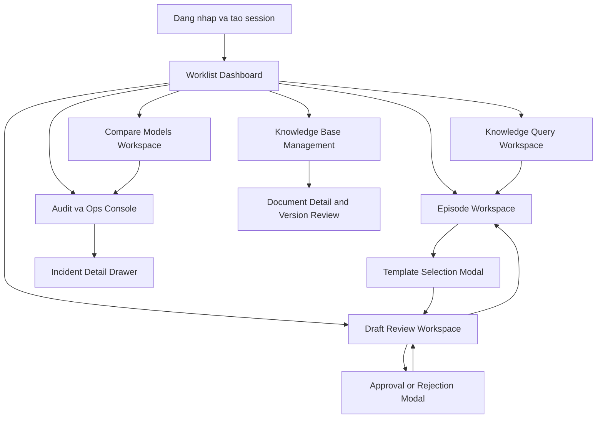
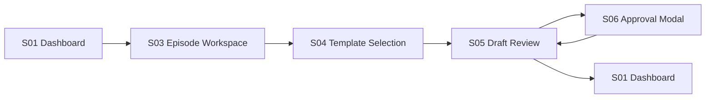
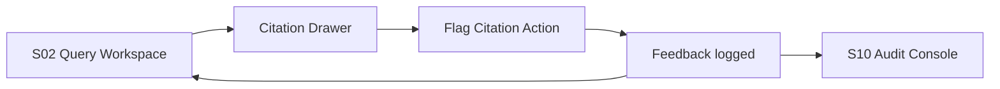
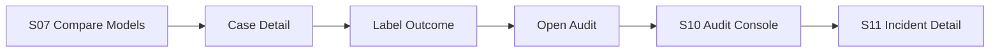

# Wireflow chi tiet screen-by-screen cho he thong UI RAG y te

## 1. Muc dich tai lieu

Tai lieu nay bo sung cho PRD UI bang mot mo ta wireflow chi tiet theo tung man hinh, de doi UX, BA, dev va QA co the:

- hieu duoc nguoi dung vao man hinh nao, di tiep ra sao;
- biet man hinh nao can thong tin gi, component gi va state gi;
- xac dinh cac branch chinh, branch loi, branch safety block va branch review;
- dung lam co so ve wireframe, prototype, user story va test scenario.

Tai lieu nay uu tien logic nghiep vu, luong an toan va kha nang review y khoa. No khong phai spec visual pixel-perfect.

## 2. Quy uoc doc wireflow

### 2.1. Quy uoc ten man hinh

| Ma | Ten man hinh |
| --- | --- |
| S00 | Dang nhap va khoi tao context |
| S01 | Worklist va Dashboard |
| S02 | Knowledge Query Workspace |
| S03 | Episode Workspace |
| S04 | Template Selection Modal |
| S05 | Draft Report Review Workspace |
| S06 | Approval and Rejection Modal |
| S07 | Compare Models Workspace |
| S08 | Knowledge Base Management |
| S09 | Document Detail and Version Review |
| S10 | Audit va Ops Console |
| S11 | Incident Detail Drawer |

### 2.2. Quy uoc node trong wireflow

- `Entry`: diem vao man hinh;
- `Primary action`: thao tac nghiep vu chinh;
- `Secondary action`: thao tac phu;
- `Blocked`: he thong chan vi policy, quyen han hoac thieu du lieu;
- `Review gate`: buoc doi con nguoi ra soat hoac phe duyet;
- `Exit`: diem thoat sang man hinh khac;
- `Loop`: quay lai man hinh hien tai sau mot thao tac.

### 2.3. Quy uoc vung giao dien

- `Zone A`: top-level context;
- `Zone B`: navigation hoac bo loc;
- `Zone C`: noi dung trung tam;
- `Zone D`: drawer, side panel, provenance panel;
- `Zone E`: action footer hoac sticky action bar.

## 3. So do dieu huong tong the

## 4. Global flow rules ap dung cho moi man hinh

### 4.1. Quy tac vao man hinh

- moi man hinh phai xac dinh duoc vai tro nguoi dung truoc khi hien noi dung nghiep vu;
- neu can patient context, man hinh phai chi mo khi co `episode_id` hop le;
- neu can review permission, he thong phai kiem tra quyen truoc khi hien action button;
- neu payload khong hop le hoac schema fail, man hinh hien state block thay vi render noi dung nhu hop le.

### 4.2. Quy tac ra khoi man hinh

- neu co noi dung dang sua chua luu, he thong phai canh bao khi nguoi dung roi man hinh;
- neu co thao tac nhay cam vua thuc hien, he thong phai cho phep mo audit event lien quan;
- neu man hinh la review screen, khong duoc roi man hinh approve bang redirect ngam.

### 4.3. Quy tac fail closed

- khong hien thi output khi citation khong load duoc ma UI van nhan la hop le;
- khong cho approve neu con warning nghiem trong mo ma policy yeu cau block;
- khong cho export neu draft chua dat status hop le;
- khong cho compare mode xuat hien voi vai tro khong du quyen.

## 5. Screen-by-screen wireflow chi tiet

## 5.1. S00 - Dang nhap va khoi tao context

### Muc tieu

- xac thuc nguoi dung;
- tai role, don vi, quyen han va policy context;
- dua nguoi dung vao dung home state theo vai tro.

### Entry

- nguoi dung mo ung dung qua URL noi bo;
- session het han va can dang nhap lai;
- nguoi dung chuyen role hoac khoa phong neu cho phep.

### Layout

- `Zone A`: logo he thong, ten module, thong bao ve intended use;
- `Zone C`: form dang nhap hoac trang thai SSO;
- `Zone D`: thong diep security, privacy notice, notice ve logging.

### Primary actions

- dang nhap qua SSO hoac auth noi bo;
- chon role mac dinh neu nguoi dung co nhieu role;
- chon don vi lam viec neu workflow phu thuoc khoa phong.

### System actions

- tai user context;
- tai feature flags;
- tai route mac dinh theo role;
- tai notice bat buoc ve logging va intended use.

### Exit conditions

- den S01 neu session hop le;
- ve error state neu auth fail;
- den blocked state neu tai khoan bi khoa.

### Edge states

- session role khong co quyen vao module yeu cau;
- auth thanh cong nhung khong co don vi duoc gan;
- he thong policy service tam thoi khong san sang.

### Telemetry can log

- login success/failure;
- selected role;
- selected department;
- policy bundle version loaded.

## 5.2. S01 - Worklist va Dashboard

### Muc tieu

- dua nguoi dung vao dung tac vu uu tien;
- tong hop draft can review, citation bi flag, tai lieu moi, su co he thong;
- giam so lan click de vao workflow chinh.

### Entry

- tu S00 sau dang nhap;
- nguoi dung bam logo home tren global header;
- sau khi hoan tat approve, reject, save hoac log feedback tu man hinh khac.

### Layout zones

- `Zone A`: global header, quick search, role chip, thong bao he thong;
- `Zone B`: bo loc worklist theo status, khoa phong, ngay, owner;
- `Zone C`: task cards va bang cong viec;
- `Zone D`: canh bao an toan, recent updates, system health;
- `Zone E`: quick actions nhu `Mo episode`, `Tra cuu tri thuc`, `Draft moi`.

### Main content blocks

- `Tasks needing review`;
- `Drafts pending approval`;
- `Recent patient episodes`;
- `Flagged citations`;
- `Knowledge updates`;
- `System health snapshot`.

### Primary actions

- mo episode tu task card;
- mo draft dang cho duyet;
- mo query workspace;
- mo compare mode neu du quyen;
- mo audit console neu co incident.

### Secondary actions

- loc va sap xep task;
- gan sao uu tien ca viec;
- danh dau da doc thong bao;
- xem tat ca knowledge updates.

### Wireflow branches

1. User click vao `draft pending approval` -> S05 voi draft duoc preload.
2. User click vao `episode needing explanation` -> S03 voi patient context duoc preload.
3. User click vao `flagged citation` -> S02 voi query session mo tai answer co flag.
4. User click vao `system issue` -> S10 voi bo loc incident.

### Empty states

- khong co cong viec nao -> hien thong diep `Khong co tac vu can xu ly` va quick links;
- khong co widget do role han che -> hien `Ban khong duoc cap quyen xem khu vuc nay`.

### Error states

- khong tai duoc health snapshot -> widget degrade rieng, khong chan ca dashboard;
- khong tai duoc worklist -> hien retry va incident id.

### Acceptance points

- nguoi dung vao duoc tac vu uu tien trong toi da 1 click tu dashboard;
- widget khong du quyen khong lam vo bo cuc;
- su co o mot widget khong lam sap toan trang.

## 5.3. S02 - Knowledge Query Workspace

### Muc tieu

- ho tro hoi dap tu guideline noi bo co citation, provenance va canh bao ro rang.

### Entry

- tu S01 qua quick action `Tra cuu tri thuc`;
- tu S03 qua hanh dong `Tra cuu guideline lien quan`;
- tu S05 qua hanh dong `Tim guideline cho field nay`.

### Layout zones

- `Zone A`: global header, patient context neu truy cap tu episode;
- `Zone B`: query composer, filter chips, suggestion chips;
- `Zone C`: answer stream, refused state, loading state;
- `Zone D`: citation drawer va document preview;
- `Zone E`: feedback bar, save query, copy answer theo quyen.

### Input elements

- free-text query box;
- bo loc loai tai lieu, khoa phong, age group, hieu luc, ngon ngu;
- toggle `Chi tai lieu dang hieu luc`;
- optional episode context chip.

### Main states

- `idle`: chua nhap query;
- `searching`: dang retrieval/generation;
- `answered`: co answer hop le;
- `refused`: khong du bang chung hoac out-of-scope;
- `failed`: loi he thong hoac policy service.

### Primary actions

- gui query;
- mo citation drawer;
- preview tai lieu goc;
- flag citation;
- danh dau answer huu ich/khong huu ich;
- mo episode lien quan neu co patient context.

### Secondary actions

- save query vao favorites;
- pin answer tam thoi;
- copy answer da redacted neu role cho phep;
- refine query bang suggestion chip.

### Detailed wireflow

1. User nhap cau hoi.
2. System validate query rong, query qua dai, query vi pham policy.
3. Neu valid -> state `searching`.
4. Retrieval xong -> generation va policy check.
5. Neu pass -> render answer card.
6. Citation list xuat hien ben phải.
7. User click citation -> mo drawer, highlight doan van.
8. User click `Flag citation` -> mini modal thu ly ly do, loop lai S02.
9. User click `Use in note` hoac `Go to episode` -> sang S03 neu co quyen.

### Safety branches

- query vuot pham vi -> hien banner `Out of scope` va khong tao answer;
- query co nguy co tiet lo PHI sai doi tuong -> block va log security event;
- citation load fail -> answer card hien `Citation unavailable`, khong hien icon hop le.

### What must always be visible

- model version;
- timestamp;
- intended use tag;
- canh bao ho tro tham khao;
- citations count;
- feedback actions.

### Interaction notes

- document preview khong che answer card hoan toan;
- drawer dong khi user bam Esc;
- focus quay lai citation vua bam sau khi dong drawer.

### Analytics

- query submitted;
- citations opened;
- refused reason shown;
- feedback submitted;
- answer copied.

## 5.4. S03 - Episode Workspace

### Muc tieu

- tap trung du lieu episode, prediction, uncertainty, explanation va cac draft lien quan tren mot man hinh.

### Entry

- tu S01 qua task card;
- tu S02 neu query co patient context;
- tu S05 khi user muon quay ve ca benh.

### Layout zones

- `Zone A`: patient context bar;
- `Zone B`: summary navigation theo tab `Tong quan`, `Imaging`, `Clinical`, `History`;
- `Zone C`: prediction, uncertainty, explanation panel;
- `Zone D`: action rail, drafts list, activity log;
- `Zone E`: sticky actions `Tao giai thich`, `Tao draft report`, `Tra cuu guideline`.

### Primary actions

- tao explanation;
- tao draft report;
- mo draft cu;
- tra cuu guideline lien quan;
- log feedback ve prediction hoac explanation.

### Detailed wireflow

1. System load episode summary, prediction, uncertainty, explainability payload.
2. Neu patient metadata mismatch -> hien warning tren Zone A.
3. User click `Tao giai thich` -> inline generation state tren Zone C.
4. Neu explanation pass policy -> render panel gom summary, evidence, caveat.
5. User click `Tao draft report` -> mo S04.
6. User click mot draft da co -> sang S05.
7. User click `Tra cuu guideline` -> mo S02 voi context chip tu dong.

### Branches

- explainability payload thieu -> button `Tao giai thich` bi disable, co tooltip;
- uncertainty cao -> hien warning va khuyen nghi review ky;
- draft dang bi nguoi khac sua -> action `Mo draft` di den read-only mode cua S05.

### Must-have modules

- patient context bar;
- prediction card;
- uncertainty card;
- explanation panel hoac placeholder;
- recent draft list;
- event timeline nho.

### Acceptance points

- nguoi dung thay duoc canh bao metadata mismatch truoc khi tao draft;
- tu episode co the den query hoac draft workflow ma khong mat context;
- explanation va prediction khong duoc trinh bay nhu ket luan chinh thuc.

## 5.5. S04 - Template Selection Modal

### Muc tieu

- buoc nguoi dung chon template dung va xac nhan pham vi truoc khi tao draft.

### Entry

- tu S03 khi user click `Tao draft report`;
- tu S01 qua quick action `Draft moi` co episode da chon.

### Layout

- modal trung tam 2 cot;
- cot trai: danh sach template dang hieu luc;
- cot phai: preview schema, intended use, field summary, warnings.

### Primary actions

- chon template;
- xem schema summary;
- xac nhan tao draft;
- huy.

### Detailed wireflow

1. System load template dang hieu luc phu hop role va context.
2. User click vao mot template.
3. Zone preview hien section, field count, required fields, read-only fields, last approved version.
4. Neu template co note nghiep vu, hien warning hoac guidance.
5. User click `Tao draft` -> validate template status, schema, role.
6. Neu pass -> sang S05 voi draft moi status `draft`.

### Blocked states

- khong co template phu hop;
- template het hieu luc trong khi modal dang mo;
- schema khong tai duoc;
- user khong du quyen tao draft loai nay.

### Acceptance points

- template khong active khong duoc chon;
- preview phai cho user thay ngay field bat buoc va field khoa;
- user phai thay intended use truoc khi xac nhan.

## 5.6. S05 - Draft Report Review Workspace

### Muc tieu

- la man hinh trung tam de xem, sua, doi chieu evidence, review va chuan bi approve/reject.

### Entry

- tu S04 sau khi tao draft moi;
- tu S01 mo draft cho review;
- tu S03 mo draft cu;
- tu thong bao he thong ve draft return for edit.

### Layout zones

- `Zone A`: draft header gom ten template, version, draft status, owner, timestamps;
- `Zone B`: section navigator, filter `All`, `Changed`, `Warnings`, `Required`, `Missing evidence`;
- `Zone C`: form editor chinh;
- `Zone D`: provenance/evidence drawer theo field dang focus;
- `Zone E`: sticky action bar `Save`, `Send review`, `Return`, `Reject`, `Approve`.

### Main content objects

- field cards hoac field rows;
- field badges `AI`, `Auto`, `Manual`, `Locked`;
- inline warning blocks;
- diff toggle;
- comment panel theo field;
- top-level safety banner.

### Primary actions

- sua field duoc phep;
- mo provenance cua field;
- mo citations cho field;
- loc field can review;
- save draft;
- gui review;
- approve;
- reject;
- return for edit.

### Detailed wireflow

1. Draft load xong, form render theo schema.
2. System validate moi field va dan nhan warning neu can.
3. User click vao mot field -> Zone D doi sang provenance lien quan.
4. User chinh sua field editable -> field badge doi sang `Manual` neu sua doi noi dung AI.
5. User bat `Diff mode` -> hien so sanh `Current` va `Original AI draft`.
6. User loc `Warnings` -> chi hien field co risk.
7. User bam `Send review` -> status `under_review`, loop lai S05 o che do review.
8. User bam `Approve` hoac `Reject` -> mo S06.

### Read-only and lock behavior

- field `Locked` khong co cursor input;
- nếu draft dang duoc mo read-only do conflict, action bar chi con `Back`, `Refresh`, `Open audit`;
- section da approve co the xem nhung khong sua neu policy khoa revision.

### Branches

- schema fail khi load -> man hinh block, chi cho `Open incident` hoac `Back`;
- citation fail cho field -> field hien badge `Evidence missing`, action approve bi chan neu field trong yeu;
- concurrent edit -> hien thong diep xung dot va reload diff;
- draft stale do template moi hon da duoc phat hanh -> hien banner `Template updated after draft generation`.

### Keyboard and productivity behaviors

- mui ten hoac J/K di chuyen field tiep theo;
- phím tat mo provenance drawer;
- tab order ro cho review nhanh;
- save nhap tam tu dong neu policy cho phep.

### Must-have visual distinctions

- AI-generated text duoc nhan biet bang badge va nen nhe;
- approved content khac voi editable content;
- severe warning su dung banner cap cao, khong chi icon nho.

### Acceptance points

- moi field trong yeu mo duoc provenance trong toi da 1 click;
- reject/return bat buoc co ly do;
- approve khong kha dung neu con blocker warning;
- nguoi duyet luon thay model version va template version tren header.

## 5.7. S06 - Approval and Rejection Modal

### Muc tieu

- buoc xac nhan cuoi cung cho hanh dong co tac dong nghiep vu.

### Entry

- tu S05 khi user click `Approve`, `Reject` hoac `Return for edit`.

### Layout

- modal co top summary, middle checklist, bottom actions.

### Approve mode

Phai hien:

- draft name;
- episode id;
- template version;
- total edited fields;
- unresolved warnings count;
- checkbox `Toi da ra soat bang chung`;
- checkbox `Toi hieu day la noi dung se duoc gan trang thai approved`.

### Reject/Return mode

Phai hien:

- ly do bat buoc;
- category: evidence issue, content issue, missing data, policy issue, schema issue, other;
- optional note;
- tu dong tao audit event.

### Branches

- neu con blocker -> approve button bi disable;
- neu user khong du quyen -> modal o che do thong bao, khong co confirm action;
- neu submit fail -> modal giu nguyen du lieu, hien incident id.

### Exit

- thanh cong -> quay ve S05 voi status moi;
- that bai -> o lai S06;
- user huy -> quay ve S05 khong doi state.

## 5.8. S07 - Compare Models Workspace

### Muc tieu

- cho phep nghien cuu va QA xem champion-challenger side-by-side ma khong lam anh huong workflow lam sang.

### Entry

- tu S01 neu user co quyen;
- tu S10 khi dieu tra incident model quality.

### Layout zones

- `Zone A`: page header, compare mode warning, experiment selector;
- `Zone B`: filters theo model pair, date range, template, department, disagreement type;
- `Zone C`: summary table;
- `Zone D`: case detail drawer side-by-side;
- `Zone E`: export benchmark, label case, open audit.

### Primary actions

- filter case set;
- mo case detail;
- gan nhan ket qua doi soat;
- xuat benchmark report;
- mo audit event lien quan.

### Detailed wireflow

1. System load experiment metadata va permission.
2. User chon model pair va bo loc.
3. Summary table update disagreement, schema pass, latency, refusal.
4. User click 1 case.
5. Drawer mo output champion va challenger side-by-side, chung mot evidence snapshot.
6. Neu co verifier flag, drawer hien panel warning rieng.
7. User gan label ket qua.
8. System luu label va de xuat them case vao test set.

### Blocked states

- khong co permission;
- evidence snapshot khong toan ven;
- chi co mot model run nen khong compare duoc.

### Acceptance points

- compare page luon hien ro banner `Khong phuc vu workflow lam sang chinh`;
- output duoc doi chieu tren cung evidence snapshot id;
- user co the loc nhanh case schema fail va disagreement cao.

## 5.9. S08 - Knowledge Base Management

### Muc tieu

- quan ly tai lieu, metadata, hieu luc, index status va template catalogue.

### Entry

- tu S01 doi voi admin hoac quan tri tri thuc.

### Layout zones

- `Zone A`: header, summary counts, quick create;
- `Zone B`: filters status, owner, type, language, department;
- `Zone C`: document table va template table;
- `Zone D`: metadata side panel;
- `Zone E`: actions `Upload`, `Submit review`, `Activate`, `Retire`, `Reindex`.

### Primary actions

- them tai lieu;
- sua metadata;
- gui review;
- activate;
- retire;
- reindex;
- mo document detail.

### Detailed wireflow

1. User vao page, system load document table.
2. User chon mot document row.
3. Side panel hien metadata, version, index status.
4. User chon `Open detail` -> den S09.
5. User thuc hien activate hoac retire neu du quyen.
6. System kiem tra metadata va workflow rule truoc khi cho thao tac.

### Branches

- thieu metadata -> action `Activate` bi disable;
- index dang chay -> hien progress, khoa mot so action;
- tai lieu superseded -> badge ro rang, khong cho active lai neu policy cam.

## 5.10. S09 - Document Detail and Version Review

### Muc tieu

- cho phep xem chi tiet tai lieu, so sanh version, metadata va tinh trang hieu luc.

### Entry

- tu S08 khi mo chi tiet mot document;
- tu S02 khi user co quyen va muon xem tai lieu goc o muc day du.

### Layout zones

- `Zone A`: document header, owner, status, effective date;
- `Zone B`: version timeline;
- `Zone C`: document preview hoac metadata form;
- `Zone D`: change log, linked citations, index history;
- `Zone E`: actions `Approve`, `Supersede`, `Retire`, `Reindex`.

### Primary actions

- xem version truoc;
- diff metadata;
- approve document;
- retire document;
- open linked queries or incidents.

### Acceptance points

- user thay ro document nao dang active;
- thay ro citation nao dang tham chieu toi version nay;
- co the truy vet index history lien quan.

## 5.11. S10 - Audit va Ops Console

### Muc tieu

- tong hop su kien, truy vet workflow va phat hien su co.

### Entry

- tu S01 qua incident widget;
- tu S05 qua `Open audit`;
- tu S07 qua `Open audit` case;
- tu S08 qua `Index history`.

### Layout zones

- `Zone A`: bo loc global theo time, user, episode, draft, model, template, incident;
- `Zone B`: saved filters va quick pivots;
- `Zone C`: event timeline hoac event table;
- `Zone D`: event detail panel;
- `Zone E`: emergency actions neu role duoc cap.

### Primary actions

- tim event;
- mo event detail;
- replay route thong qua links sang S02, S03, S05, S08;
- mo incident detail;
- trigger emergency action neu co quyen.

### Detailed wireflow

1. User dat filter.
2. System tra timeline su kien.
3. User click event.
4. Detail panel hien payload da redacted, policy decision, provenance links, user actions.
5. User click `Open incident detail` -> S11.
6. User click linked draft -> S05 read-only hoac linked query -> S02.

### Critical branches

- security event -> panel do cap cao, hidden payload detail theo role;
- policy block event -> hien decision tree tom tat;
- rollback action -> yeu cau confirm 2 buoc.

### Acceptance points

- co the truy tu approved draft ve generation event, evidence va edits;
- payload nhay cam duoc redacted dung vai tro;
- emergency action duoc log rieng.

## 5.12. S11 - Incident Detail Drawer

### Muc tieu

- xem nhanh mot incident ma khong roi khoi Audit Console.

### Entry

- tu S10 khi click incident id;
- tu widget system health neu route qua audit.

### Layout

- drawer ben phai, co tabs `Summary`, `Timeline`, `Impact`, `Actions`, `Linked objects`.

### Primary actions

- assign owner;
- doi status incident;
- link toi draft/query/document lien quan;
- trigger remediation action;
- export incident summary.

### Acceptance points

- khong can mo trang moi de xem incident co ban;
- lien ket den doi tuong nghiep vu phai ro rang va mo duoc;
- remediation action phai bi khoa neu role khong du quyen.

## 6. Modal, drawer va overlay flows bo sung

### 6.1. Citation Drawer

Co the mo tu S02, S05, S09.

Phai hien:

- citation ordinal;
- ten tai lieu;
- version;
- effective date;
- owner;
- excerpt duoc highlight;
- nut `Open full document` neu du quyen.

Branch:

- citation khong con kha dung -> badge `Outdated` hoac `Unavailable` va link incident neu co.

### 6.2. Field Comment Popover

Co the mo tu S05.

Phai cho phep:

- de comment theo field;
- tag loai van de;
- nhin lich su comment ngan;
- xac dinh ai da comment.

### 6.3. Permission Denied Modal

Co the mo o bat ky screen nao.

Phai hien:

- hanh dong nao dang bi chan;
- ly do chung;
- role hien tai;
- cach lien he admin neu can.

### 6.4. Unsaved Changes Guard

Co the mo tu S05, S08, S09.

Lua chon:

- `Luu va roi`;
- `Bo thay doi`;
- `Quay lai`.

## 7. Cross-screen user journeys chi tiet

## 7.1. Journey A - Bac sy tu dashboard den approve draft

Dieu kien thanh cong:

- khong mat patient context o bat ky buoc nao;
- user thay bang chung cho field trong yeu truoc approval;
- sau approval, dashboard cap nhat ngay trang thai.

## 7.2. Journey B - Nguoi dung flag citation tu query

Dieu kien thanh cong:

- flag khong lam mat answer hien tai;
- audit event sinh ra co the tim lai duoc trong S10.

## 7.3. Journey C - QA dieu tra disagreement model

Dieu kien thanh cong:

- case detail phai mo cung evidence snapshot;
- tu compare sang audit khong mat model pair context.

## 8. Trang thai va branch matrix theo tung screen

| Screen | Happy path | Empty | Warning | Blocked | Error | Read-only |
| --- | --- | --- | --- | --- | --- | --- |
| S01 | Co | Co | Co | It gap | Co | Khong can |
| S02 | Co | Co | Co | Co | Co | Co mot phan |
| S03 | Co | It gap | Co | Co | Co | Co mot phan |
| S04 | Co | Co | Co | Co | Co | Khong |
| S05 | Co | It gap | Co rat nhieu | Co | Co | Co |
| S06 | Co | Khong | Co | Co | Co | Khong |
| S07 | Co | Co | Co | Co | Co | Khong |
| S08 | Co | Co | Co | Co | Co | Co mot phan |
| S09 | Co | Co | Co | Co | Co | Co |
| S10 | Co | Co | Co | Co | Co | Co mot phan |
| S11 | Co | Co | Co | Co | Co | Co |

## 9. Quy tac instrumentation de support QA va nghiem thu

Moi man hinh can co su kien analytics va audit event toi thieu:

| Screen | Event bat buoc |
| --- | --- |
| S01 | dashboard_opened, task_clicked |
| S02 | query_submitted, answer_rendered, citation_opened, citation_flagged |
| S03 | episode_opened, explanation_requested, draft_creation_started |
| S04 | template_selected, draft_creation_confirmed |
| S05 | draft_opened, field_edited, provenance_opened, review_submitted |
| S06 | approval_confirmed, rejection_confirmed, return_requested |
| S07 | compare_case_opened, compare_label_submitted |
| S08 | document_uploaded, metadata_updated, activate_requested |
| S09 | version_opened, document_retired, reindex_requested |
| S10 | audit_filter_applied, event_opened, rollback_initiated |
| S11 | incident_opened, incident_status_changed |

## 10. Danh sach test scenario de xuat theo wireflow

### 10.1. Positive scenarios

- user vao S01 va mo dung draft can duyet;
- user query o S02 va mo duoc citation trong 2 thao tac;
- user tao draft tu S03 -> S04 -> S05 thanh cong;
- reviewer approve tu S05 qua S06 thanh cong;
- QA gan label disagreement tren S07 va tim lai duoc audit event tren S10.

### 10.2. Safety scenarios

- query out-of-scope bi block tai S02;
- draft co missing evidence tai S05 nen approve bi disable;
- user khong du quyen mo compare mode tai S07;
- tai lieu superseded xuat hien badge ro tai S09;
- rollback o S10 yeu cau xac nhan 2 buoc.

### 10.3. Concurrency scenarios

- draft dang bi nguoi khac sua khi user mo S05;
- template doi version giua luc user dang mo S04;
- citation bi retire sau khi answer da render o S02;
- incident dang duoc admin khac cap nhat o S11.

## 11. Mapping wireflow sang backlog thiet ke

| Nhom cong viec | Screen lien quan | Muc tieu thiet ke |
| --- | --- | --- |
| Navigation shell | S00-S01 | Khung app, role, routing, global alerts |
| Query experience | S02 | Composer, answer card, citation drawer |
| Episode experience | S03 | Context bar, prediction panel, explanation |
| Draft creation and review | S04-S06 | Template modal, review editor, approval modal |
| Research compare | S07 | Side-by-side compare, labeling, benchmark export |
| Knowledge governance | S08-S09 | Document lifecycle, metadata, version detail |
| Audit and incident | S10-S11 | Timeline, detail drawer, emergency action |

## 12. Tieu chi hoan thanh tai lieu wireflow nay

Tai lieu duoc xem la du dung cho giai doan wireframe neu:

- doi UX co the dung moi screen o day de ve low-fidelity wireframe;
- doi dev co the tach route, state va API contract o muc co ban;
- doi QA co the rut ra happy path, safety path va blocked path;
- doi nghiep vu co the doi chieu xem human review gate da dung cho cac use case chua;
- doi AI va governance co the thay ro cho nao provenance, warning, compare mode va audit duoc dat vao UI.

## 13. Ket luan

Wireflow nay dat trong tam vao viec bien cac yeu cau y te va guardrail thanh luong thao tac cu the. Neu phai uu tien thiet ke truoc, thu tu nen la:

1. S05 va S06 vi day la tam diem an toan cua report drafting.
2. S02 vi day la diem tiep xuc thuong xuyen nhat voi tri thuc noi bo.
3. S03 va S04 vi day la cau noi giua patient context va draft workflow.
4. S10 vi day la diem truy vet bat buoc khi pilot va nghiem thu.

Sau tai lieu nay, buoc hop ly tiep theo la chuyen tung screen thanh bo wireframe low-fidelity voi annotation component, state va event.